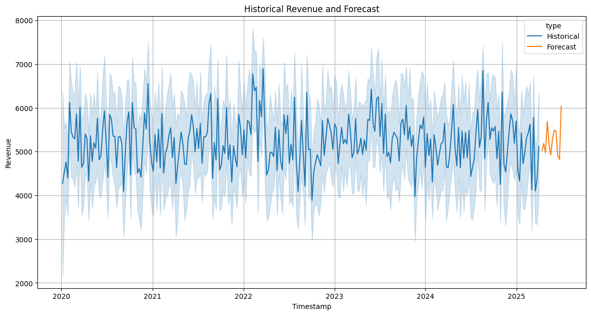
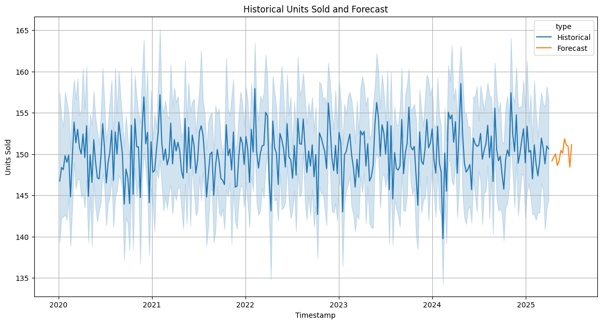

# Supplement Sales Forecasting with AutoGluon

---

This project implements a comprehensive time series forecasting solution for predicting supplement sales revenue and units sold using AutoGluon's automated machine learning framework. The system leverages advanced feature engineering techniques including lag variables, rolling statistics, and seasonal patterns to generate accurate 12-week forecasts for business planning and inventory management.

## Key Components

### Data Preprocessing
Handles missing values, outlier detection, and data quality assurance to ensure robust model training.

### Feature Engineering
Creates sophisticated temporal features including lag variables at multiple time intervals, rolling averages, seasonal decomposition, and time-based covariates such as holiday effects and promotional periods.

### AutoGluon Integration
Utilizes automated model selection and ensemble methods to optimize forecasting performance without manual hyperparameter tuning.

### Visualization
Generates comprehensive trend analysis and forecast visualizations using matplotlib and seaborn for business insights.

## Applications

The forecasting system generates 12-week predictions suitable for inventory planning, revenue budgeting, marketing strategy optimization, and supply chain management decisions.

---

### 1. Installation
Install necessary libraries including `pip`, `setuptools`, `wheel`, `autogluon`, and `uv`.

### 2. Data Loading
Load the supplement sales data from a CSV file into a pandas DataFrame.

### 3. Data Preprocessing and Feature Engineering
- Convert the `Date` column to datetime objects.
- Sort the data by date.
- Add an `item_id` column required by AutoGluon Time Series.
- Rename the `Date` column to `timestamp` for compatibility.
- Create lag features for `Revenue` and `Units Sold`.
- Calculate rolling statistics (mean and standard deviation) for `Revenue` and `Units Sold`.
- Extract time-based features (week of year, month, quarter, day of week).
- Create a binary feature indicating if an item is on discount.
- Drop rows with missing values resulting from lag and rolling computations.
- Convert the prepared Data Frame into an AutoGluon Time Series Data Frame.

---

## Revenue Forecasting
- Initialize a Timeseries Predictor for the `Revenue` target.
- Specify the prediction length (12 weeks) and frequency (`W` for weekly).
- Train the predictor on the prepared time series data.
- Generate revenue forecasts for the next 12 weeks.

---

## Units Sold Forecasting
- Generate future dates for the forecasting horizon.
- Prepare a Data Frame with future covariate values (`Price`, `Discount`, time-based features, and discount flag).
- Initialize a Timeseries Predictor for the `Units Sold` target, including the prepared future covariates.
- Train the predictor on the time series data.
- Generate Units Sold forecasts for the next 12 weeks using the future covariates.

---

## Visualization

### Revenue Forecast
Plot the historical data and the mean forecast for both metrics using `matplotlib` and `seaborn` to visualize the trends and predictions.

### Units Sold Forecast
Plot the historical data and the mean forecast for both metrics using `matplotlib` and `seaborn` to visualize the trends and predictions.

---

## Requirements
- Python 3.11+
- pandas
- autogluon
- uv
- matplotlib
- seaborn
